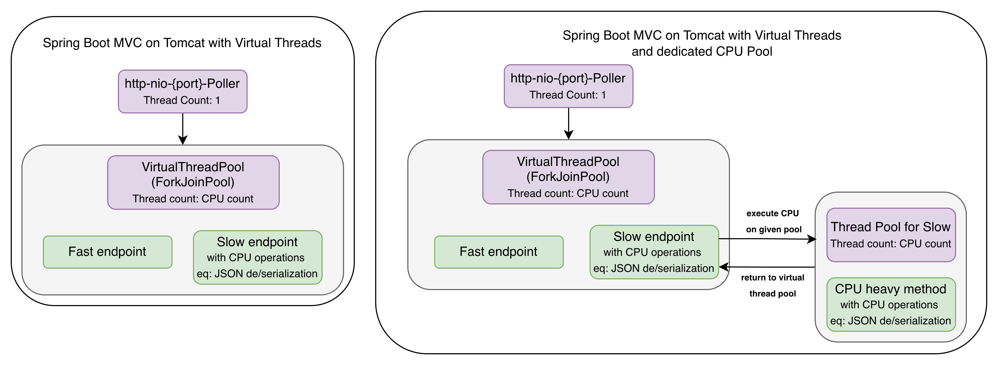
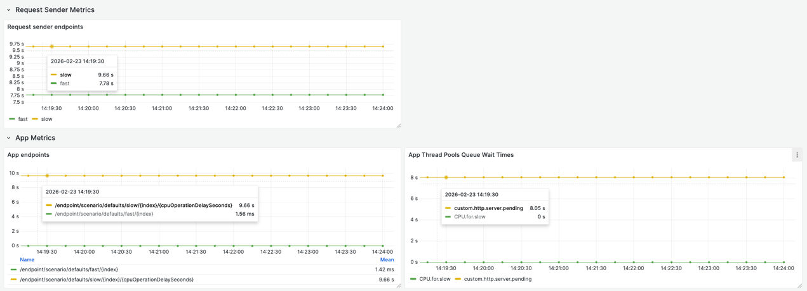
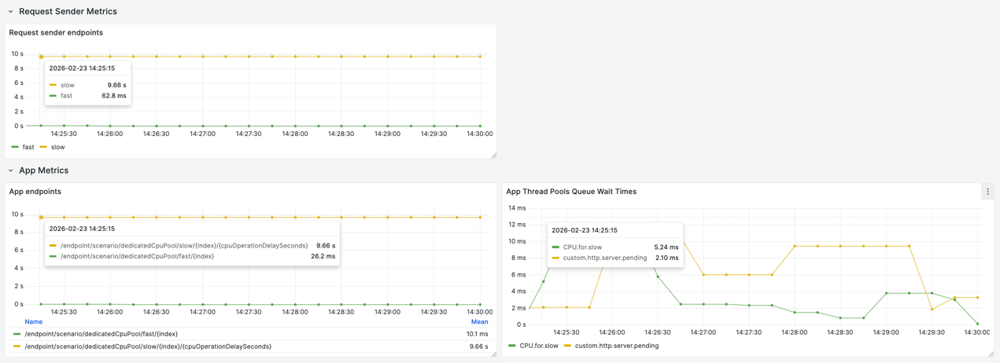

## Spring Boot app with Tomcat on Virtual Threads

- Scenario:
    - send `Runtime.getRuntime().availableProcessors()` requests on `slow endpoint`
        - each `heavyCpuCode` will take 10 seconds
    - wait 2 seconds
    - send `Runtime.getRuntime().availableProcessors()` requests on `fast endpoint`

#### HighLevel Overview



<details>
  <summary>Click to learn How To Run</summary>

1. Run `docker-compose up`
2. Run `RequestSenderApp`
3. Run `Bulkhead_02_WebMVC_VirtualThreads`
4. Run one of those:

```shell
curl http://localhost:8080/send-requests-on-different-endpoints/scenario/defaults
#or 
curl http://localhost:8080/send-requests-on-different-endpoints/scenario/dedicatedCpuPool
```

5. Open Grafana and look for metrics http://localhost:3000

</details>

#### Results, when endpoints are being executed on Virtual Thread Pool

In this example, metric `http.server.requests` is not telling the truth

|                Element                 | Expected response times | Metrics from App | Metrics from RequestSender |
|:--------------------------------------:|:-----------------------:|:----------------:|:--------------------------:|
|             Slow endpoint              |           10s           |      10s ✅       |           10s ✅            |
|             Fast endpoint              |        almost 0s        |   almost 0s ❌    |            8s ✅            |
| App queue wait time<br>(custom metric) |           8s            |       8s ✅       |       Not Applicable       |



#### Results, when `heavyCpuCode` is being executed on dedicated thread pool

|                Element                 | Expected response times | Metrics from App | Metrics from RequestSender |
|:--------------------------------------:|:-----------------------:|:----------------:|:--------------------------:|
|             Slow endpoint              |           10s           |      10s ✅       |           10s ✅            |
|             Fast endpoint              |        almost 0s        |   almost 0s ✅    |        almost 0s ✅         |
| App queue wait time<br>(custom metric) |           0s            |       0s ✅       |       Not Applicable       |

