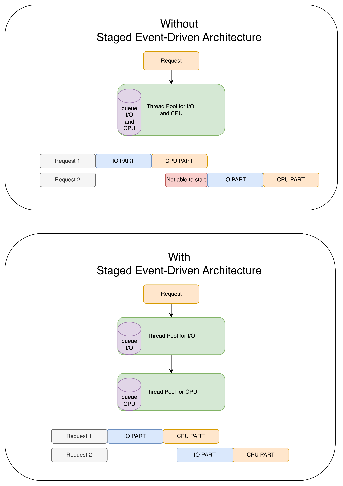

# Staged Event-Driven Architecture (SEDA) here

In those examples, Staged Event-Driven Architecture (SEDA) pattern is being used.

It has many thread pools, one endpoint.

It improves asynchronous processing performance by using a dedicated thread pool for each stage of request execution.

It's similar to a factory assembly line.



When threads are busy or blocked, the application may behave as follows:

- the app performs CPU‑bound work, e.g., JSON deserialization for `request X`
- and then sends an HTTP‑client request for `request X+1`

A more desirable behavior looks like this:

- the app performs CPU‑bound work, e.g., JSON deserialization for `request X`
- while simultaneously waiting for the HTTP‑client response for `request X+1`


## Examples with app using http client

There is only one `dummy endpoint` in apps:

```kotlin
httpClient.getData()

// and then
Operations.someBlockingIO(blockingIODelaySeconds)
// or
Operations.heavyCpuCode(cpuOperationDelaySeconds)
// and
ResponseEntity.ok((SomeResponse("response")))
```

## Apps examples 
- every one of them includes `how to run` and detailed threads diagram
- [01-webmvc-classic-threads-rest-client](01-webmvc-classic-threads-rest-client/01-webmvc-classic-threads-rest-client.md)
- [02-webmvc-virtual-threads-rest-client](02-webmvc-virtual-threads-rest-client/02-webmvc-virtual-threads-rest-client.md)
- [03-webmvc-coroutines-classic-threads-rest-client](03-webmvc-coroutines-classic-threads-rest-client/03-webmvc-coroutines-classic-threads-rest-client.md)
- [04-webmvc-coroutines-virtual-threads-rest-client](04-webmvc-coroutines-virtual-threads-rest-client/04-webmvc-coroutines-virtual-threads-rest-client.md)
- [05-webflux-netty-server-client-netty](05-webflux-netty-server-client-netty/05-webflux-netty-server-client-netty.md)
