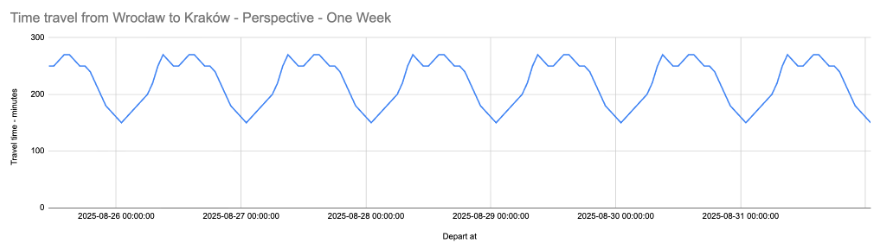
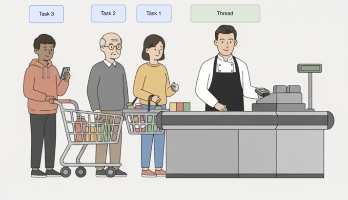
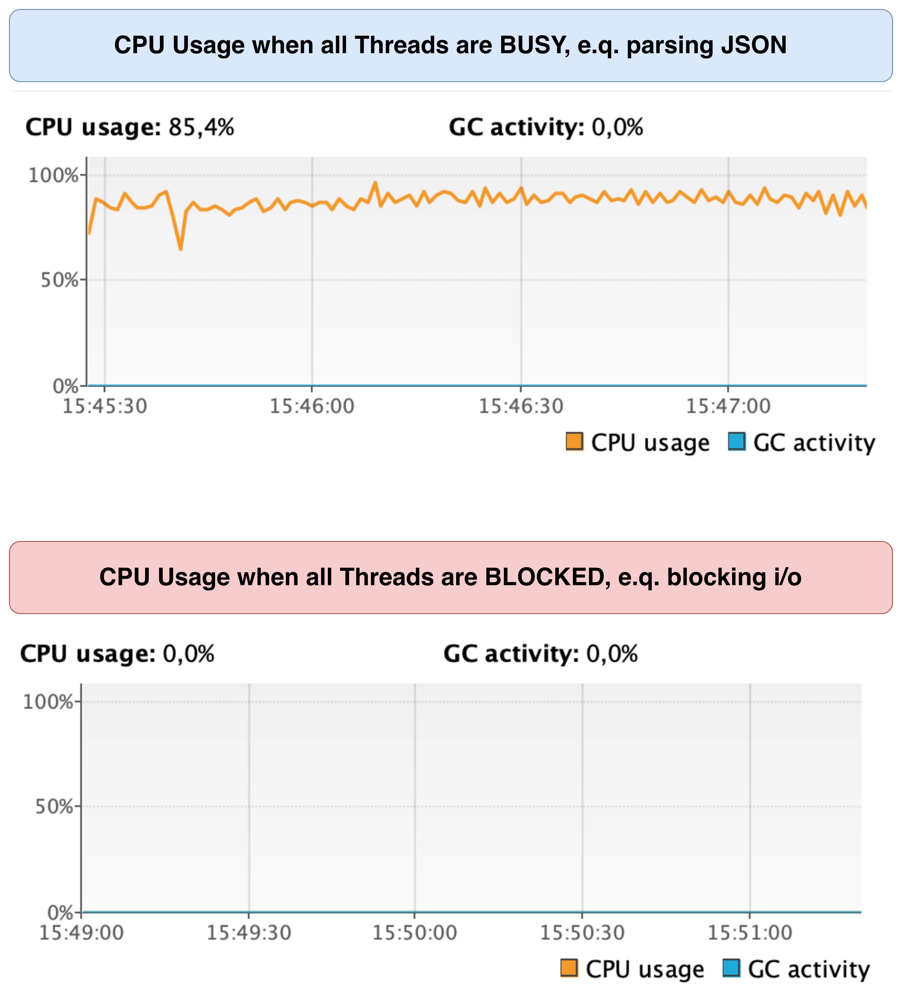
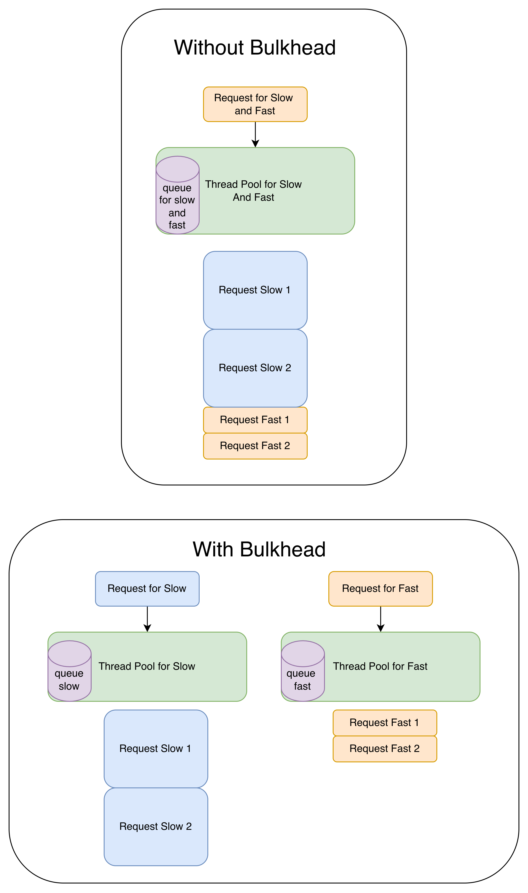

# CPU-Bound, I/O Bound: Queues can be everywhere

An educational repository demonstrating 
how thread‑pool tasks queue wait time appears 
across different types of tasks and
how easily it hides in plain sight. 
It contains pure Kotlin examples,
some un-expected things about thread pool
and Spring Boot examples with defaults and some solutions 
of how to monitor, get rid of queues and make response times faster.

Sometimes adding a new thread pool can make a system `several times faster`,
especially when high queue wait time is the dominant bottleneck.

In other cases it may have the opposite effect,
for example when all threads are busy with CPU‑bound work
then adding additional threads can make things only worse.

# Quick check for queues

Queues can be present on a daily basis, and they can be hidden in plain sight.
It's like traffic jam in the city - it can be there every day.

The image below shows an estimated travel time
from Wrocław to Kraków (cities in Poland).
It's faster during night, slower during day.



It's the same for the service.
If there are peaks and valleys in response times
for the latest few days,
then probably queues are present
in given service or it's dependencies.

> Please remember, that during night there might be no traffic at all. 
> From the other hand, there might be "day all the time", 
> if service is being used globally.

Interested in details? 
How to monitor thread pool queues and how to fix them?
Please keep reading!

# Table of Contents

- [TL;DR](#tldr)
- [Short introduction](#short-introduction)
- [How to use this repo](#how-to-use-this-repo)
- [Prerequisites & Scope](#prerequisites--scope)
- [Thread, Thread Pools](#thread-thread-pools)
- [When queue wait time happens](#when-queue-wait-time-happens)
- [How to measure queue wait time](#how-to-measure-queue-wait-time)
- [Fastest way to reduce queue wait](#fastest-way-to-reduce-queue-wait)
- [A little bit slower way to reduce response times](#a-little-bit-slower-way-to-reduce-response-times)
- [Presentation / Blog examples](#presentation--blog-examples)
- [Thread Pool (Un)Expected Things](#thread-pool-unexpected-things)
- [Spring Boot Examples](#spring-boot-examples)
- [Contributing](#contributing)

# TL;DR

CPU usage is misleading when it comes to thread pool tasks queue wait time.
Queues can be present at any CPU utilization level.

What to do when queue wait time > 0?

- just add more threads
  - absolutely simplest, really
    - does every app truly need to be ultra‑fast and hyper‑optimized?
    - probably not
    - it's like a soft version of `add more instances` :D
- Thread Pool Isolation -> aka Bulkhead
  - many thread pools, many endpoints
  - It protects from the "noisy neighbour"
  - request A -> Thread Pool A
  - request B -> Thread Pool B
- Thread Stage Isolation -> aka Stage Event-Driven Architecture (SEDA)
  - many thread pools, different stage of endpoint execution
  - request -> IO Pool 1 -> CPU Pool 1 -> IO Pool 2 - CPU Pool 2 etc
  - maximize cpu, minimize queue wait time
- Hybrid: Bulkhead + SEDA
- maybe just more threads/instances
- other things

And what if queue size is almost 0?

- maybe cache is needed
- maybe async calls (http, database) can be done
- maybe deep dive with e.g. async-profiler
- maybe fewer threads/instances are needed ❤️
- maybe some other things? 🤔

There are 3 main modules in this repo:
- [01-presentation-blog-examples](01-presentation-blog-examples) - minimal Kotlin examples
- [02-thread-pool-un-expected-things](02-thread-pool-un-expected-things) - some edge cases and pitfalls
- [03-spring-examples](03-spring-examples) - Spring Boot demos with Grafana dashboards

# Short introduction
Many different systems behave surprisingly similarly: 
they rely on threads or thread pools, 
make HTTP requests in blocking or non‑blocking mode, 
and parse JSON while executing business logic. 
But sooner or later they begin to slow down - 
like driving through a city during rush hour, 
when every street hides another traffic jam.

Let's say, that regular application has some `I/O-bound tasks`
and some `CPU-bound tasks`.
For example, getting data from http-client is an `I/O-bound task`,
and doing JSON serialization/deserialization 
and probably everything else is a `CPU-bound task`.
When the traffic is low, then response times are flat, and everything is fine.
But when the traffic grows, then response times are increasing, 
and the system becomes slow.
On metric, it looks like a sinusoidal wave, with peaks(e.g. day) 
and valleys(e.g. night).
The more traffic, the higher peaks.
And it may happen on a daily basis.
One of the reason for that are `queues`. 
They store info about pending tasks waiting for execution.


Let's use given analogy to understand this better:
`a cashier scanning groceries`. In this example, two metrics matter:

- queue wait time - how long customers stand in line
- scanning time



Based on that store owner can make some decisions, e.g. open new checkout line.

But what if... there is only one metric... 
what does it mean? Honestly, no idea 😀
If time is e.g. 10 seconds, then:

- maybe X seconds standing in line + 10 seconds scanning time
- maybe 8 seconds standing in line + 2 seconds scanning time
- maybe 10 seconds standing in line + X seconds scanning time

Another important thing to mention is that customers (tasks in the queue) 
may not be aware of the cashier utilization (CPU usage). 
Cause a queue can appear at any CPU utilization level.

So it's good to monitor standing in line time and scanning time as two separate metrics.

`Bonus`
> If the queue is really high, it’s probably worth calculating a `Time to Consume Queue` metric :D
>
> It can be useful when doing migrations for millions of records :D


# How to use this repo

Treat this repository as a Sandbox - an educational repo,
rather than production‑ready code.
The examples are intentionally minimal.
They focus solely on showing thread‑pool tasks queue wait time.

Programming principles such as SOLID, KISS, DRY, or Hexagonal Architecture were not considered when creating this repo.
Tracing is also not included.

Check also [The USE Method](https://www.brendangregg.com/usemethod.html) by Brendan Gregg

Steps for this repo:
- start with reading `this readme.md` file
- jump to [presentation-blog-examples module](01-presentation-blog-examples) and run examples
- jump to [thread-pool-un-expected-things module](02-thread-pool-un-expected-things) and learn about some (un)expected things
- jump to [spring-examples module](03-spring-examples) and run examples & see results in Grafana

# Prerequisites & Scope

### Language / framework

Examples are written in Kotlin, but the rules of queuing and resource isolation are universal.
Whether Go, Rust, Java, or any other language is used,
the hardware limits and queuing effects are probably the same :D

### Metrics

Different libraries and frameworks handle thread pools in their own ways.  
Because of that, some of them may not expose fully accurate metrics 
related to queue wait time out of the box.
Usually only `queue size is present.`
In some cases, the metrics may also behave differently than expected.
Simply because the library may not be fully aware of the underlying threads and queues.

### Other pools

Queue wait time can happen also, when there is a `Connection Pool` or any `other Pool`.
Rules are exactly the same. But it's out of scope for this repo.
In this repo there is only `Thread Pool`.

### Thread returning response from server

The response from an endpoint is always returned on a server thread.
But it's intentionally omitted in diagrams, to make them easier to read.

### Thread pool saturation

When all threads in thread pool are busy, then thread pool is saturated.
In this repository, the term `queue wait time` 
is used to describe the time of the saturation.

### Backpressure & Queues Limits

To keep examples minimal and focused on queue wait time metrics, 
this repo doesn't cover Backpressure or Rejected Execution Policies. 
In production, always remember that an unbounded queue is a `hidden`
memory leak waiting to happen.

# Thread, Thread Pools

There is always some `Thread` - like a cashier at the checkout:

```kotlin
fun main() {
    Thread.ofPlatform()
        .name("some-thread")
        .start {
            println("${Thread.currentThread()} : Hello world!")
        }
        .join()
}
```

Or a `Thread Pool`, like many cashiers working in parallel:

```kotlin
fun main() {
    val threadPoolExecutor = ThreadPoolExecutor(1, 1, 10, TimeUnit.SECONDS, LinkedBlockingQueue(10))
    threadPoolExecutor
        .submit {
            println("${Thread.currentThread()} : Hello world!")
        }
        .get()
}
```

What, if customers are waiting in a line?

- measure queue wait time as one metric
- measure scanning time as another metric

#### Debugging thread pools
When dealing with threads, it's `ABSOLUTELY GOOD IDEA` to check which thread executes code.
Given code is simple enough to check this :D

```kotlin
println("Current thread: ${Thread.currentThread()}")
println("Current thread isVirtual: ${Thread.currentThread().isVirtual}")
```

#### Some default thread pools sizes
Default Thread Pool Sizes:

- Spring Boot WebMVC + Tomcat  
  Default thread pool size: 200 threads


- Spring Boot WebMVC + Tomcat (Virtual Threads)  
  Default platform(carrier) thread pool size: equal to the number of CPU cores


- Spring Boot WebFlux + Netty  
  Default event loop size: equal to the number of CPU cores

#### What about Schedulers, Dispatchers?

Under the hood: just threads.

Project Reactor:

```kotlin
private val scheduler =
    Schedulers.fromExecutor(
        ThreadPoolExecutor(
            1, 1, 10, TimeUnit.SECONDS, LinkedBlockingQueue(10)
        )
    )
```

Kotlin Coroutines:

```kotlin
private val dispatcher =
    ThreadPoolExecutor(1, 1, 10, TimeUnit.SECONDS, LinkedBlockingQueue(10))
        .asCoroutineDispatcher()
```

For any other library... it's probably the same 😄

# When queue wait time happens

`Queue wait time` may occur when all threads in thread pool are:
- busy 
  - e.g.: JSON serialization/deserialization 
  - high cpu utilization
  - thousands of `cpu bound tasks`? probably bad
- blocked 
  - e.g.: waiting for response from http-client
  - low cpu utilization
  - thousands of `blocking tasks`? probably not so bad at all

It's like all cashiers are busy/blocked, and customers are waiting in line.



# How to measure queue wait time

In order to measure queue wait time (and more*) use `ExecutorServiceMetrics` 
from [Micrometer](https://docs.micrometer.io/micrometer/reference/reference/jvm.html):

```kotlin
import io.micrometer.core.instrument.binder.jvm.ExecutorServiceMetrics

val threadPoolExecutor = 
    ThreadPoolExecutor(1, 1, 10, TimeUnit.SECONDS, LinkedBlockingQueue(10))

val monitoredThreadPoolExecutor = 
    ExecutorServiceMetrics
        .monitor(
            meterRegistry,
            threadPoolExecutor,
            threadPoolName,
        )
```

Thanks to this code, the metric `executor.idle` will be available - yes, 
this is literally queue wait time.

If the value of this metric is higher than 0, it means tasks 
are already waiting in the queue instead of 
being executed immediately - in other words, customers are standing in line.

Under the hood code is wrapping `Runnable` in `MonitoredRunnable` and then it is executed.
This is a simplified illustration - Micrometer uses the same idea:

```kotlin
class MonitoredRunnable(
  private val delegate: Runnable,
) : Runnable {

  val runnableInstanceCreatedAt = System.nanoTime()

  override fun run() {
    log("Queue wait time took: ${System.nanoTime() - runnableInstanceCreatedAt} ns")

    val startExecution = System.nanoTime()
    delegate.run()
    log("Task execution took: ${System.nanoTime() - startExecution} ns")
  }
}
```

Check [Micrometer JVM Metrics](https://docs.micrometer.io/micrometer/reference/reference/jvm.html)
for more metric related to thread pools.

# Fastest way to reduce queue wait

Just add more threads, unless there are only CPU‑bound tasks:

- really, absolutely simplest
  - does every app truly need to be ultra‑fast and hyper‑optimized?
  - probably not
  - it's like a soft version of `add more instances` :D

What can happen under high load?

- noisy neighbour, one endpoint consumes all resources
- slow app:
  - all threads are doing I/O
  - or all threads are doing CPU
  - other things

# A little bit slower way to reduce response times

There are two patterns (maybe there is some more?) that can be used to reduce response times, when queue wait time is high:
- bulkhead pattern
  - many thread pools, many endpoints
  - it protects resources
  
- Staged Event-Driven Architecture (SEDA)
  - many thread pools, different stage of endpoint execution
  - it makes resources faster
  

In those approaches, additional thread pools may be needed,
thus more context-switching. But context-switching is not a problem, 
when it is not excessive.

# Presentation / Blog examples

The module [01-presentation-blog-examples](01-presentation-blog-examples/src/main/kotlin/com/nalepa/demo)
contains pure Kotlin, zero frameworks, zero magic.
Only the minimal code needed to illustrate the concepts.
Simple files with a `main()` method that can be executed after cloning this repository.

# Thread Pool (Un)Expected Things

Sometimes things does not work as expected.
Knowing about them, can save a lot of debugging hours.

Please check [02-thread-pool-un-expected-things](02-thread-pool-un-expected-things/thread-pool-un-expected-things.md)

# Spring Boot Examples

> Each example includes instructions on how to run it,
as well as a detailed threads diagram.

There are two different types of examples:

- applications with `fast` and `slow` endpoints
    - bulkhead pattern is used
    - it protects resources
    - check [03-spring-examples/bulkhead module](03-spring-examples/apps/bulkhead/readme-bulkhead.md)

- applications with only one endpoint, but under the hood, http-client is called
    - Staged Event-Driven Architecture (SEDA) is used
    - it makes resources faster
    - check [03-spring-examples/seda module](03-spring-examples/apps/seda/readme-seda.md)

# Contributing

Found this useful? Star the repo!

If you spot an error, feel free to open an issue or fork the repo and submit a
Pull Request with a fix.

Got examples from production? Please share them!
