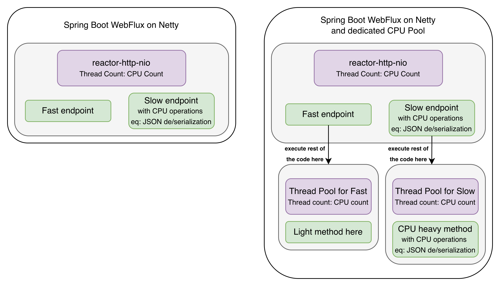
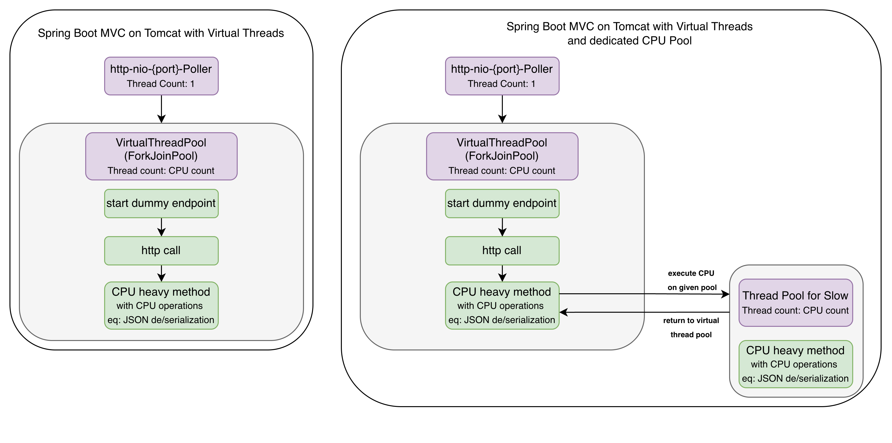
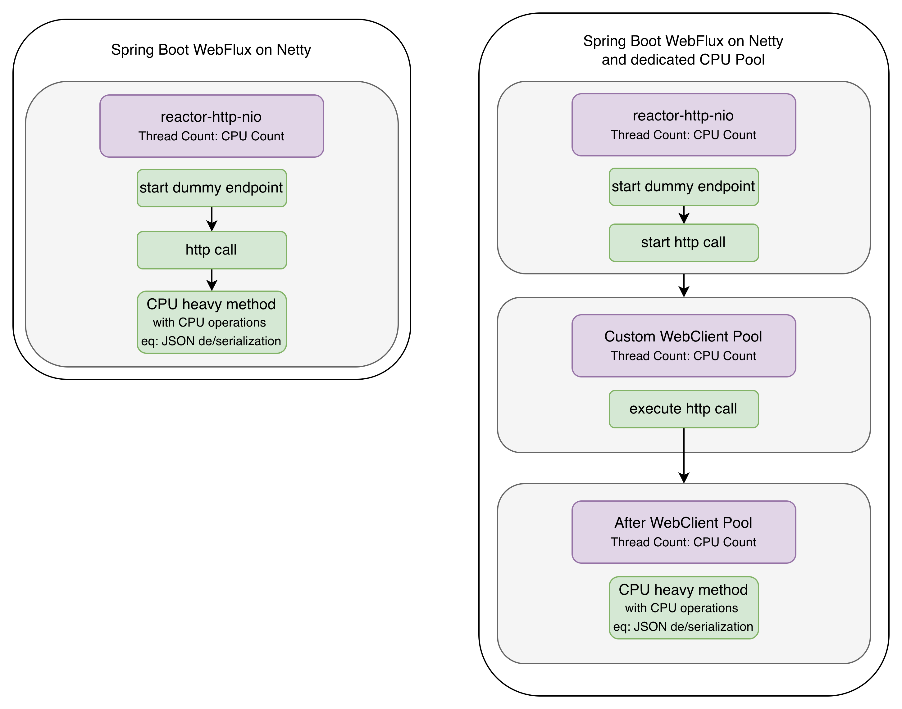

# CPU-Bound, I/O Bound: Queues can be everywhere

Repository which help to demonstrate thread pool saturation based on different types of tasks.
> Treat this repo rather as a sandbox, not production ready code.

Check [The USE Method](https://www.brendangregg.com/usemethod.html) by Brendan Gregg

# Notes

## Note 1
Examples here are as minimal as possible.
They are only showing thread pool saturation.
Programming principles like: SOLID, KISS, DRY, Hexagonal Architecture were not being taken into consideration when creating this repo.

## Note 2

Libraries/frameworks `MAY` not be aware about thread pools, so metrics may not tell the truth.
In this repository there is only Spring Boot used where depending on the configurations metrics are telling the truth or not.

## Note 3

Saturation can happen also, when there is a Connection Pool or any other Pool. 
Rules are exactly the same. But it's out of scope for this repo.

## Note 4
Response from endpoint is returned always on server thread. 
But it's intentionally omitted in diagrams, to make them easier to read.

# Examples

There are two different types of examples:

- applications with `fast` and `slow` endpoints
- applications with only one endpoint, but under the hood, http-client is called

## Examples with `fast` and `slow` endpoints

From `saturation` perspective it doesn't matter, whether thread is:

- busy - eq: JSON serialization/deserialization
- blocked - eq: waiting for response from http-client

But it does matter from threading perspective, so depending on the configuration `slow endpoint` is one of those:

- `Thread.sleep(Duration.ofSeconds(blockingTimeSeconds))`
- `heavyCpuCode(cpuOperationDelaySeconds)`

`NOTE`

From CPU `utilization` perspective it does matter whether apps are doing `Blocking I/O` or `CPU Bound Code`:

- thousands of `blocked threads` - not so bad
- thousands of `cpu bound code threads` - probably very bad

- Check [ThreadsPerformanceTest](apps/different-endpoints/webmvc-classic-threads/src/test/kotlin/com/nalepa/demo/common/ThreadsPerformanceTest.kt)


For `fast endpoints` it's always:

- `ResponseEntity.ok((SomeResponse("fast")))`

### 1/3 - Spring Boot app with classic Tomcat with 200 threads

<details>
  <summary>Click to learn How To Run</summary>

1. Run `docker-compose up`
2. Run `RequestSenderApp`
3. Run `ClassicTomcatAppDifferentEndpoints`
4. Run one of those:

```shell
curl 'http://localhost:8080/send-requests-on-different-endpoints/scenario/defaults?batchSize=200'
#or 
curl 'http://localhost:8080/send-requests-on-different-endpoints/scenario/dedicatedCpuPool?batchSize=200'
```

5. Open Grafana and look for metrics http://localhost:3000

</details>

- Scenario:
    - send 200 requests on `slow endpoint` - every thread will just sleep for 10 seconds
    - wait 2 seconds
    - send 200 requests on `fast endpoint`

#### HighLevel Overview


#### Results, when endpoints are being executed on Tomcat Thread Pool

In this example, metric `http.server.requests` is not telling the truth

|                  Element                  | Expected response times | Metrics from App | Metrics from RequestSender |
|:-----------------------------------------:|:-----------------------:|:----------------:|:--------------------------:|
|               Slow endpoint               |           10s           |      10s ✅       |           10s ✅            |
|               Fast endpoint               |        almost 0s        |   almost 0s ❌    |            8s ✅            |
| Server Saturation time<br>(custom metric) |           8s            |       8s ✅       |       Not Applicable       |

#### Results, when every endpoint has dedicated thread pool - Tomcat thread only accept here requests

|                  Element                  | Expected response times | Metrics from App | Metrics from RequestSender |
|:-----------------------------------------:|:-----------------------:|:----------------:|:--------------------------:|
|               Slow endpoint               |           10s           |      10s ✅       |           10s ✅            |
|               Fast endpoint               |        almost 0s        |   almost 0s ✅    |        almost 0s ✅         |
| Server Saturation time<br>(custom metric) |           0s            |       0s ✅       |       Not Applicable       |

### 2/3 - Spring Boot app with Tomcat on Virtual Threads

<details>
  <summary>Click to learn How To Run</summary>

1. Run `docker-compose up`
2. Run `RequestSenderApp`
3. Run `VirtualAppDifferentEndpoints`
4. Run one of those:

```shell
curl http://localhost:8080/send-requests-on-different-endpoints/scenario/defaults
#or 
curl http://localhost:8080/send-requests-on-different-endpoints/scenario/dedicatedCpuPool
```

5. Open Grafana and look for metrics http://localhost:3000

</details>

- Scenario:
    - send `Runtime.getRuntime().availableProcessors()` requests on `slow endpoint` - each `heavyCpuCode` will
      take 10 seconds
    - wait 2 seconds
    - send `Runtime.getRuntime().availableProcessors()` requests on `fast endpoint`

#### HighLevel Overview


#### Results, when endpoints are being executed on Virtual Thread Pool

In this example, metric `http.server.requests` is not telling the truth

|                  Element                  | Expected response times | Metrics from App | Metrics from RequestSender |
|:-----------------------------------------:|:-----------------------:|:----------------:|:--------------------------:|
|               Slow endpoint               |           10s           |      10s ✅       |           10s ✅            |
|               Fast endpoint               |        almost 0s        |   almost 0s ❌    |            8s ✅            |
| Server Saturation time<br>(custom metric) |           8s            |       8s ✅       |       Not Applicable       |

#### Results, when `heavyCpuCode` is being executed on dedicated thread pool

|                  Element                  | Expected response times | Metrics from App | Metrics from RequestSender |
|:-----------------------------------------:|:-----------------------:|:----------------:|:--------------------------:|
|               Slow endpoint               |           10s           |      10s ✅       |           10s ✅            |
|               Fast endpoint               |        almost 0s        |   almost 0s ✅    |        almost 0s ✅         |
| Server Saturation time<br>(custom metric) |           0s            |       0s ✅       |       Not Applicable       |

### 3/3 - Spring Boot WebFlux with Netty

<details>
  <summary>Click to learn How To Run</summary>

1. Run `docker-compose up`
2. Run `RequestSenderApp`
3. Run `WebfluxAppAppDifferentEndpoints`
4. Run one of those:

```shell
curl http://localhost:8080/send-requests-on-different-endpoints/scenario/defaults
#or 
curl http://localhost:8080/send-requests-on-different-endpoints/scenario/dedicatedCpuPool
```

5. Open Grafana and look for metrics http://localhost:3000

</details>

- Scenario:
    - send `Runtime.getRuntime().availableProcessors()` requests on `slow endpoint` - each `heavyCpuCode` will
      take 10 seconds
    - wait 2 seconds
    - send `Runtime.getRuntime().availableProcessors()` requests on `fast endpoint`

#### HighLevel Overview


#### Results, when endpoints are being executed on Netty thread pool

In this example, metric `http.server.requests` is not telling the truth

|                  Element                   | Expected response times | Metrics from App | Metrics from RequestSender |
|:------------------------------------------:|:-----------------------:|:----------------:|:--------------------------:|
|               Slow endpoint                |           10s           |      10s ✅       |           10s ✅            |
|               Fast endpoint                |        almost 0s        |   almost 0s ❌    |            8s ✅            |
| Server Saturation time<br>(missing metric) |         Missing         |     Missing      |       Not Applicable       |

#### Results, when `heavyCpuCode` is being executed on dedicated thread pool

|                  Element                   | Expected response times | Metrics from App | Metrics from RequestSender |
|:------------------------------------------:|:-----------------------:|:----------------:|:--------------------------:|
|               Slow endpoint                |           10s           |      10s ✅       |           10s ✅            |
|               Fast endpoint                |        almost 0s        |   almost 0s ✅    |        almost 0s ✅         |
| Server Saturation time<br>(missing metric) |         Missing         |     Missing      |       Not Applicable       |

## Examples with app using http client

When threads are busy/blocked, then it may happen that from application perspective:

- app is doing CPU work, eq: JSON deserialization for request X
- and then send http-client request for request X+1

We would probably like to change that to:

- app is doing CPU work, eq: JSON deserialization for request X
- at the same time, app is waiting for response from http-client for request X+1

There is only one `dummy endpoint` in apps:

- `httpClient.getData()`
- and then `heavyCpuCode(cpuOperationDelaySeconds)`

### 1/2 - Spring Boot app with Tomcat on Virtual Threads

<details>
  <summary>Click to learn How To Run</summary>

1. Run `docker-compose up`
2. Run `RequestSenderApp`
3. Run `VirtualAppWithHttpClient`
4. Run `MockExternalServiceApp`
5. Run one of those:

```shell
curl http://localhost:8080/send-requests-app-with-client/scenario/defaults
#or 
curl http://localhost:8080/send-requests-app-with-client/scenario/dedicatedCpuPool
```

6. Open Grafana and look for metrics http://localhost:3000

</details>

- Scenario:
    - send first batch of requests `Runtime.getRuntime().availableProcessors()` on `dummy endpoint`
        - mock app will return response after 0s
    - wait 2 seconds
    - send second batch of requests `Runtime.getRuntime().availableProcessors()` on `dummy endpoint`
        - mock app will return response after 9s

#### HighLevel Overview


#### Results, when endpoint is executed only on Virtual Thread Pool

In this example, metric `http.server.requests` is not telling the truth

|                  Element                  | Expected response times |      Metrics from App       | Metrics from RequestSender |
|:-----------------------------------------:|:-----------------------:|:---------------------------:|:--------------------------:|
|      `first batch` on dummy endpoint      |           10s           | 19s (no info about batch) ❌ |           10s ✅            |
|     `second batch` on dummy endpoint      |           19s           | 19s (no info about batch) ❌ |           27s ✅            |
|            Http Client metric             |      from 0s to 9s      |        from 0s to 9s        |       Not Applicable       |
| Server Saturation time<br>(custom metric) |           8s            |            8s ✅             |       Not Applicable       |

#### Results, when `heavyCpuCode` is being executed on dedicated thread pool

|                  Element                  | Expected response times |      Metrics from App       | Metrics from RequestSender |
|:-----------------------------------------:|:-----------------------:|:---------------------------:|:--------------------------:|
|      `first batch` on dummy endpoint      |           10s           | 19s (no info about batch) ❌ |           10s ✅            |
|     `second batch` on dummy endpoint      |           19s           | 19s (no info about batch) ❌ |           19s ✅            |
|            Http Client metric             |      from 0s to 9s      |        from 0s to 9s        |       Not Applicable       |
| Server Saturation time<br>(custom metric) |           0s            |            0s ✅             |       Not Applicable       |

### 2/2 - Spring Boot WebFlux with Netty

<details>
  <summary>Click to learn How To Run</summary>

1. Run `docker-compose up`
2. Run `RequestSenderApp`
3. Run `NettyServerAppWithHttpClient`
4. Run `MockExternalServiceApp`
5. Run one of those:

```shell
curl http://localhost:8080/send-requests-app-with-client/scenario/defaults
#or 
curl http://localhost:8080/send-requests-app-with-client/scenario/dedicatedCpuPool
```

6. Open Grafana and look for metrics http://localhost:3000

</details>

- Scenario:
    - send first batch of requests `Runtime.getRuntime().availableProcessors()` on `dummy endpoint`
        - mock app will return response after 0s
    - wait 2 seconds
    - send second batch of requests `Runtime.getRuntime().availableProcessors()` on `dummy endpoint`
        - mock app will return response after 9s

#### HighLevel Overview


#### Results, when endpoint is executed only on Netty thread pools

In this example, metric `http.client.requests` is not telling the truth

|                  Element                   | Expected response times |      Metrics from App       | Metrics from RequestSender |
|:------------------------------------------:|:-----------------------:|:---------------------------:|:--------------------------:|
|      `first batch` on dummy endpoint       |           10s           | 27s (no info about batch) ✅ |           10s ✅            |
|      `second batch` on dummy endpoint      |           19s           | 27s (no info about batch) ✅ |           27s ✅            |
|             Http Client metric             |      from 0s to 9s      |      from 0s to 18s ❌       |       Not Applicable       |
| Server Saturation time<br>(missing metric) |         Missing         |           Missing           |       Not Applicable       |
| Client Saturation time<br>(custom metric)  |           8s            |            8s ✅             |       Not Applicable       |

#### Results, when `heavyCpuCode` is being executed on dedicated thread pool

|                  Element                   | Expected response times |      Metrics from App       | Metrics from RequestSender |
|:------------------------------------------:|:-----------------------:|:---------------------------:|:--------------------------:|
|      `first batch` on dummy endpoint       |           10s           | 19s (no info about batch) ✅ |           10s ✅            |
|      `second batch` on dummy endpoint      |           19s           | 19s (no info about batch) ✅ |           19s ✅            |
|             Http Client metric             |      from 0s to 9s      |      from 0s to 9s  ✅       |       Not Applicable       |
| Server Saturation time<br>(missing metric) |         Missing         |           Missing           |       Not Applicable       |
| Client Saturation time<br>(custom metric)  |           0s            |            0s ✅             |       Not Applicable       |

